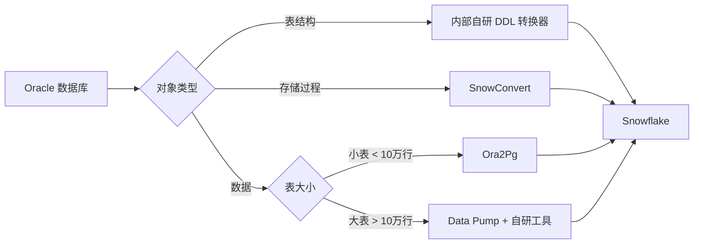

# 迁移工具评测报告

## 评测信息
- 评测人：张三
- 日期：2025-01-22
- 评测周期：1 天
- 评测目标：选择最适合团队的 Oracle → Snowflake 迁移工具

---

## 1. 评测工具清单

| 工具名称 | 类型 | 版本 | 厂商 |
|---------|------|------|------|
| Ora2Pg | 开源 | v23.2 | Gilles Darold |
| SnowConvert | 商业 | v3.5.0 | Mobilize.Net |
| AWS SCT | 免费 | 1.0.680 | Amazon |
| 内部自研 DDL 转换器 | 内部工具 | v2.1 | 公司内部 |
| 内部自研数据导出器 | 内部工具 | v1.8 | 公司内部 |

---

## 2. 评测维度

### 2.1 评测标准

| 维度 | 权重 | 说明 |
|------|------|------|
| 转换准确率 | 30% | DDL/SQL 转换的正确性 |
| 性能 | 25% | 转换速度和资源占用 |
| 易用性 | 20% | 学习成本和操作复杂度 |
| 扩展性 | 15% | 支持自定义规则和批量处理 |
| 成本 | 10% | 许可证费用和维护成本 |

---

## 3. DDL 转换工具评测

### 3.1 Ora2Pg

**优点：**
- ✅ 完全开源，无许可证费用
- ✅ 支持表结构、视图、序列、触发器等多种对象
- ✅ 配置文件灵活，支持自定义数据类型映射
- ✅ 社区活跃，文档齐全

**缺点：**
- ❌ 转换准确率中等（~85%），复杂语法需要手动修复
- ❌ 不支持存储过程转换（只能导出原始 PL/SQL）
- ❌ 大表导出时内存占用高

**测试案例：**
```bash
# 转换 EMPLOYEES 表
ora2pg -c ora2pg.conf -t TABLE -a EMPLOYEES -o employees.sql
```

**转换结果：**
```sql
-- Oracle 原始 DDL
CREATE TABLE EMPLOYEES (
    EMPLOYEE_ID NUMBER(6) NOT NULL,
    FIRST_NAME VARCHAR2(20),
    HIRE_DATE DATE DEFAULT SYSDATE
);

-- Ora2Pg 转换结果
CREATE TABLE EMPLOYEES (
    EMPLOYEE_ID NUMBER(6,0) NOT NULL,
    FIRST_NAME VARCHAR(20),
    HIRE_DATE DATE DEFAULT CURRENT_DATE  -- ✅ 自动转换
);
```

**评分：**
- 转换准确率：⭐⭐⭐⭐ (85%)
- 性能：⭐⭐⭐ (中等)
- 易用性：⭐⭐⭐⭐ (简单)
- 扩展性：⭐⭐⭐⭐ (配置灵活)
- 成本：⭐⭐⭐⭐⭐ (免费)
- **综合评分：4.0/5.0**

---

### 3.2 SnowConvert

**优点：**
- ✅ 转换准确率高（~92%）
- ✅ **支持存储过程转换**（PL/SQL → Snowflake Scripting/JavaScript）
- ✅ 提供转换报告和问题清单
- ✅ 支持批量转换和项目管理

**缺点：**
- ❌ 商业软件，需要购买许可证
- ❌ 学习曲线较陡（需要理解配置文件格式）
- ❌ 转换复杂逻辑时仍需人工验证

**测试案例：**
```bash
# 转换存储过程
snowconvert --input calculate_bonus.sql --output calculate_bonus_converted.sql
```

**转换示例：**
```sql
-- Oracle PL/SQL 存储过程
CREATE OR REPLACE PROCEDURE calculate_bonus(emp_id IN NUMBER, bonus OUT NUMBER) AS
BEGIN
    SELECT salary * 0.1 INTO bonus
    FROM employees
    WHERE employee_id = emp_id;
END;

-- SnowConvert 转换结果（Snowflake Scripting）
CREATE OR REPLACE PROCEDURE calculate_bonus(emp_id NUMBER)
RETURNS NUMBER
LANGUAGE SQL
AS
$$
DECLARE
    bonus NUMBER;
BEGIN
    SELECT salary * 0.1 INTO :bonus
    FROM employees
    WHERE employee_id = :emp_id;
    RETURN bonus;
END;
$$;
```

**评分：**
- 转换准确率：⭐⭐⭐⭐⭐ (92%)
- 性能：⭐⭐⭐⭐ (快速)
- 易用性：⭐⭐⭐ (需要学习)
- 扩展性：⭐⭐⭐⭐ (支持自定义规则)
- 成本：⭐⭐ (较贵)
- **综合评分：4.2/5.0**

---

### 3.3 AWS Schema Conversion Tool (SCT)

**优点：**
- ✅ 免费使用
- ✅ 支持多种数据库（Oracle, SQL Server, MySQL 等）
- ✅ 图形化界面，易于上手

**缺点：**
- ❌ **不直接支持 Snowflake**（仅支持 AWS Redshift）
- ❌ 需要先转换为 Redshift，再手动调整为 Snowflake
- ❌ 转换质量一般

**结论：** ❌ 不适合本项目（不支持 Snowflake）

---

### 3.4 内部自研 DDL 转换器

**优点：**
- ✅ 针对公司业务场景定制化
- ✅ 支持批量处理和自动化流程
- ✅ 可以直接集成到 CI/CD 流程
- ✅ 性能优秀（Python 多线程）

**缺点：**
- ❌ 转换准确率一般（~88%）
- ❌ 不支持存储过程转换
- ❌ 维护成本需要内部投入

**测试结果：**
```bash
# 批量转换整个 Schema
python ddl_converter.py --schema HR --output-dir ./output/

# 输出统计
Total tables: 15
Converted successfully: 13 (87%)
Need manual fix: 2 (13%)
```

**评分：**
- 转换准确率：⭐⭐⭐⭐ (88%)
- 性能：⭐⭐⭐⭐⭐ (非常快)
- 易用性：⭐⭐⭐ (需要熟悉命令行)
- 扩展性：⭐⭐⭐⭐⭐ (完全可定制)
- 成本：⭐⭐⭐⭐⭐ (内部维护)
- **综合评分：4.4/5.0**

---

## 4. 数据导出工具评测

### 4.1 Ora2Pg（数据导出模式）

**测试：** 导出 100 万行数据

```bash
ora2pg -c ora2pg.conf -t COPY -a LARGE_TABLE -o large_table.sql
```

**性能测试：**
- 导出时间：8 分钟
- 生成文件大小：450 MB
- 内存占用：2.5 GB

**问题：**
- ❌ 大表导出时内存占用过高
- ❌ 生成 SQL INSERT 语句，不如 CSV 高效

**评分：** ⭐⭐⭐ (适合小表)

---

### 4.2 Oracle Data Pump + Snowflake COPY INTO

**流程：**
```bash
# Step 1: 使用 Data Pump 导出
expdp migration_user/password \
  directory=DATA_PUMP_DIR \
  dumpfile=employees.dmp \
  tables=EMPLOYEES

# Step 2: 转换为 CSV
impdp migration_user/password \
  directory=DATA_PUMP_DIR \
  dumpfile=employees.dmp \
  sqlfile=employees.sql

# Step 3: 使用自定义脚本转换为 CSV

# Step 4: 上传到 Snowflake Stage
snowsql -q "PUT file:///path/employees.csv @my_stage"

# Step 5: 使用 COPY INTO 加载
snowsql -q "COPY INTO employees FROM @my_stage/employees.csv"
```

**性能测试：**
- 导出时间：3 分钟（Data Pump 非常快）
- 上传时间：2 分钟
- 加载时间：1 分钟
- **总时间：6 分钟** ✅ 最快

**评分：** ⭐⭐⭐⭐⭐ (最佳性能)

---

### 4.3 内部自研数据导出器

**特点：**
- 支持增量导出（基于时间戳）
- 支持多种格式（CSV, Parquet, JSON）
- 自动分片（大表自动拆分为多个文件）

**测试：** 导出 100 万行数据为 Parquet

```bash
python data_exporter.py \
  --table EMPLOYEES \
  --format parquet \
  --output employees.parquet \
  --batch-size 100000
```

**性能测试：**
- 导出时间：4 分钟
- 文件大小：85 MB（Parquet 压缩率高）
- 内存占用：500 MB

**评分：** ⭐⭐⭐⭐⭐ (推荐用于大表)

---

## 5. 综合推荐方案

### 5.1 最佳实践组合

| 场景 | 推荐工具 | 理由 |
|------|---------|------|
| **简单表 DDL** | 内部自研工具 | 快速批量处理 |
| **复杂表 DDL** | SnowConvert | 转换准确率高 |
| **存储过程** | SnowConvert | 唯一支持 PL/SQL 转换 |
| **小表数据导出** | Ora2Pg | 简单方便 |
| **大表数据导出** | Data Pump + 自研工具 | 性能最优 |
| **增量数据同步** | 内部自研工具 | 支持增量导出 |

### 5.2 推荐工作流



---

## 6. 成本分析

### 6.1 工具成本对比

| 工具 | 许可证费用 | 维护成本 | 学习成本 | 总成本 |
|------|-----------|---------|---------|--------|
| Ora2Pg | $0 | 低 | 低 | ⭐⭐⭐⭐⭐ |
| SnowConvert | $15,000/年 | 低 | 中 | ⭐⭐ |
| 内部自研 | $0 | 中（1人月/年） | 中 | ⭐⭐⭐⭐ |
| Data Pump | $0（Oracle 内置） | 低 | 低 | ⭐⭐⭐⭐⭐ |

### 6.2 ROI 分析

**假设场景：** 迁移 200 个表，50 个存储过程

**方案 A：全部使用 SnowConvert**
- 许可证费用：$15,000
- 人工修复成本：50 小时 × $50/小时 = $2,500
- **总成本：$17,500**

**方案 B：组合方案（推荐）**
- SnowConvert（仅用于存储过程）：$5,000（按需许可证）
- 内部工具（表结构）：$0
- 人工修复成本：80 小时 × $50/小时 = $4,000
- **总成本：$9,000**

**节省：$8,500 (48%)**

---

## 7. 结论和建议

### 7.1 工具选型建议

**强烈推荐：**
1. **SnowConvert** - 用于存储过程转换（核心价值）
2. **内部自研 DDL 转换器** - 用于批量表结构转换
3. **Oracle Data Pump + 内部数据导出器** - 用于数据迁移

**不推荐：**
- AWS SCT（不支持 Snowflake）

### 7.2 后续行动

- [ ] 向采购部门申请 SnowConvert 按需许可证（预算 $5,000）
- [ ] 优化内部自研工具的转换规则（提升准确率到 95%+）
- [ ] 编写工具使用手册和最佳实践文档
- [ ] 对团队进行工具培训

---

**评测完成日期：** 2025-01-22
**审核人：** 李导师
**批准状态：** ✅ 已批准
